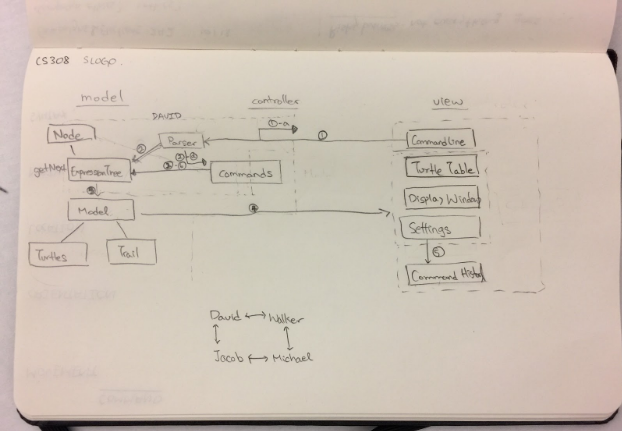
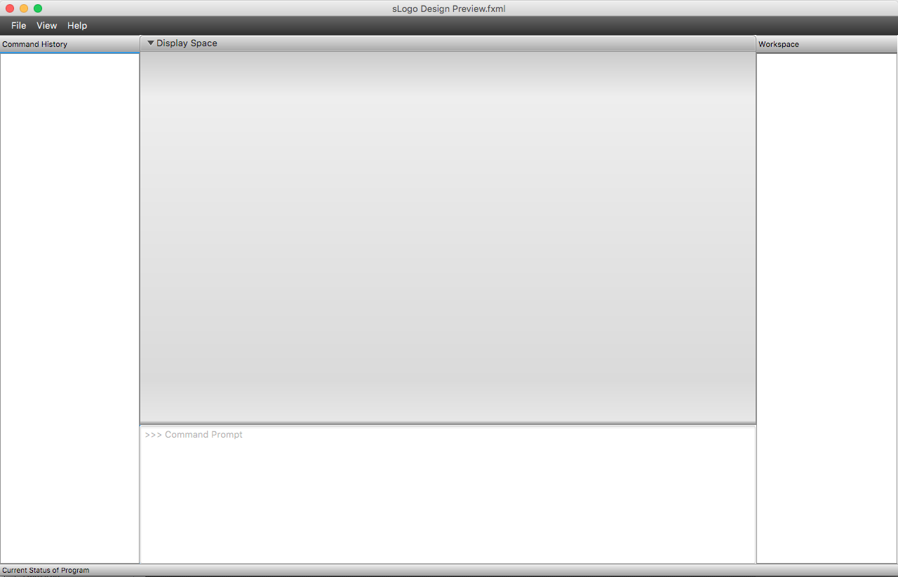

sLogo
=======
#### Team 4
Michael Seaberg, Walker Eacho, David Yoon, Jacob Warner

# Introduction
Through this project, we hope to create a simple LOGO IDE that can be used by not only novice programmers, but also experienced coders.  We intend to create a design that is easily extensible and elegant.  The design will consist of a front-end, which handles the GUI and the user inputs into a command line, and a back-end, which handles command interpretation and the underlying model.  Data will all flow through the design in a loop, passing from the front-end’s command line to the back-end’s parser, from the parser to the model, and from the model to the display.

# Design Overview
The program is divided into two main parts: the front-end and the back-end. The front-end contains five main elements:

 - the display window
 - command line  
 - history of commands
 - turtle information panel
 - settings panel

The back-end encompasses both:

 - the model with the turtles as well as
 - the parser with the commands and the expression tree.


Our four APIs are consisted of Back-end Internal & External + Front-end Internal & External APIs. The block diagram below outlines our main design and certain dependencies in our program.

**The Back-end Internal API** facilitates the conversation between the Model and the Expression Tree Class. The Parser ultimately creates a Command class instance and passes it to the Expression Tree class. The ExpressionTree class then adds a command and stores the commands in a binary tree format. Then the Model gets the next command from the ExpressionTree class. From the model side, the Turtle class gives the Command class the access it needs to make Command objects that can affect the Model class’ Turtles, as well as access to Model so that it can make Command objects that affect the Model itself.

**The Back-end External API** facilitates the conversation between the back-end and the front-end. The Parser class checks input given to it by the front-end, and can return error messages to the front-end when it receives faulty commands.  The Model class then updates the DisplayWindow by giving it access to its current state.  The Turtle class also gives the DisplayWindow access to its getter methods so the DisplayWindow can update turtles.  The Model also lets multiple DisplayWindows register and deregister themselves so that the Model and the View can be bound.

**The Front-end Internal API** facilitates the communication between the UserInterface and all display related functions. It will process any changes made by the user, be it a button press, a new SLogo command, or a change in parameters, and pass it through the appropriate channels to the Backend.

**The Front-end External API** facilitates the communication between the Parser class and the CommandLine class.  The Parser class will be able to get commands from the CommandLine for it’s own use in the back-end.  This API will also allow the Model class and the DisplayWindow class to communicate.  This will allow the Model to update the DisplayWindow class and connect the DisplayWindow class.




# User Interface
The user interface will consist of five main sections: the display window, the command line, the workspace, the command history window, and the settings panel. The user’s main method of input is the command line. By typing commands in the Logo language into this space and pressing enter, user’s can move and draw with turtles contained inside of an environment in the display window. After pressing enter, the command will then show up as typed in the command history list. If the command was read as valid, it will show up in the command history unmarked. If the parser returned that the command was invalid, the command will show up in the command history highlighted in red. A user can rerun a valid command by simply clicking on the command in the history window. All of the turtle objects that are present in the display window along with their parameters (such as position, pen color, etc.) will be shown in the workspace list. The settings window can be shown by going into the ‘File’ dropdown in the menu bar. The settings window can be used to change various parameters of different turtles, in addition to using the command line. A bar at the bottom of the screen displays the current state of the program. States include, but are not limited to, the user typing, a simulation running, or the program waiting for some prompt. Also, any error that occurs (besides invalid commands) is presented to the user in a popup error window with an appropriate message.  A rough draft of the user interface is shown in the picture below.



# API Details

## Front-End
#### DisplayWindow
Internal API:
```java
	public DisplayWindow(double Width);
	void addTurtleToDisplay(Turtle newTurtle);
	void draw();
	public void update();
	public void setModel(Model model);
```

#### Workspace
Internal API:
```java
	public Workspace(double maxWidth, double maxHeight);
	Turtle getTurtle(int turtleNumber);
```

#### CommandLine
Internal API:
```java
	public CommandLine(double Width);
	boolean isCommandReady();
	String getCommand();
	void setCommand(String command);
	void setCommandImmediately(String command);
```

#### History
Internal API:
```java
	public HistoryViewer(double maxWidth, double maxHeight);
	void addElementToHistory(String command, boolean goodOrBad);
	void clearHistory();
	History getHistory();
	String getElementAtIndex(int index);
	String getLast();
	int getSize();
```

#### Options
```java
	public Options(double Width,double Height,CommandLine myCommandLine();
```


## Back-End
#### Parser
Internal API:
```java
	public ExpressionTree();
	public Command(String);
```

External API:
```java
	public Parser();
	public boolean checkCommand(String command);
	public String getErrorMessage();
```


#### ExpressionTree
Internal API:
```java
	public Command getNextCommand();
	public void addCommand();
```


#### Model
Internal API:
```java
	public void clear();
	public void addTurtle(Turtle turtle);
```

External API:
```java
	public void register();
	public void unregister();
	public Model getUpdate(DisplayWindow view);
	public List<Turtle> getTurtles();
```


#### Turtle
Internal API:
```java
	public void moveForward(int delta);
	public void moveBack(int delta);
	public void setXY(int x, int y);
	public void home();
	public void setHeading(double theta);
	public void faceToward(int x, int y);
	public void turnRight(double theta);
	public void turnLeft(double theta);
	public void showTurtle();
	public void hideTurtle();
	public void dropPen();
	public void raisePen();
```

External API:
```java
	public int[] getPosition();
	public double getOrientation();
	public boolean isPenUp();
	public boolean isVisible();
```


# Design Considerations

Our biggest design consideration was to determine how to back-end and the front-end should communicate.  We considered two different implementations.

1. We considered sending only the parts of the model which had been updated to the view.  This approach was attractive because it was efficient; no unnecessary information would have to be transported.  However, we were concerned that the view might end up becoming the storage place for raw data, which seemed to go against the purpose of having a model in the first place.
2. We also considered sending the entire model up to the view, and having the view constantly update itself to the new model.  This implementation was attractive because it allowed the view to only serve as a display and for the model to always hold all of the raw data.  This approach was unnattractive because it would make the view have to redraw the whole model each iteration, which creates a lot of unnecessary work for the view.

Our current verdict is to solve this design problem through binding.  The display will be bound to the model, and the model will update the display as it changes.  To implement this design we will have to learn how to create a relationship between the display and the model, so that only the new changes to the model will be what the model passes up while the model still holds all of the raw data.

# Team Responsibilities
### Front-End Team
The Front-End will be divided between Walker and Michael.
Walker will be primarily responsible for the command line (and communicating those commands to the backend) and the command history as well as the options panel.

Michael will be primarily responsible for the view display (and communicating with the model in the backend), the parameter editor, and settings.

Both developers will have secondary responsibilities for the other’s primary roles, most notably: Walker taking secondary responsibility for the parameter editor, and Michael taking secondary responsibility for the options panel.

### Back-End Team
David -  Back-End Communication | Command Parser
Jacob - Deep Back-End | Model
The Back-end will be divided between David and Jacob.

David will be primarily responsible for parsing and interpreting commands from the front end and sending them to the model.

Jacob will be primarily responsible for the model and communicating with the view (Michael).

Both developers will have secondary responsibilities for the other’s primary roles, most notably: David taking secondary responsibility for some of the model controls and Jacob taking secondary responsibility for some of the commands that need to be parsed.
